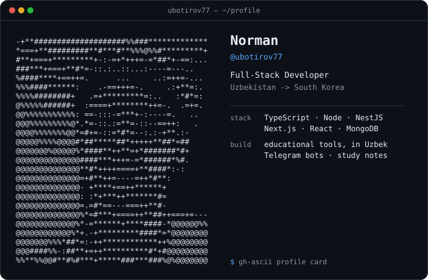

<picture>
  <source media="(prefers-color-scheme: dark)" srcset="dark_mode.svg" />
  <source media="(prefers-color-scheme: light)" srcset="light_mode.svg" />
  
</picture>

# 💫 About Me:
 I'm Norman, a Full-Stack Developer from Uzbekistan 🇺🇿 currently studying in South Korea 🇰🇷.  

# 💻 Tech Stacks that I am learning:
                        
# 📊 GitHub Stats:
 
 

---

